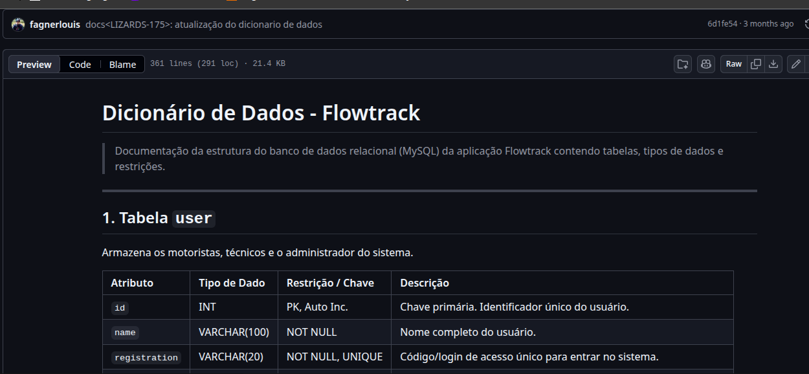
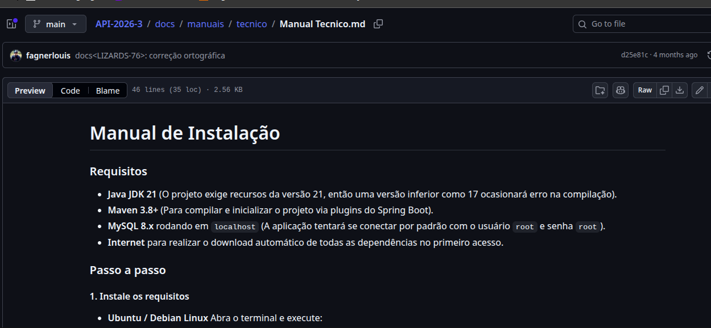
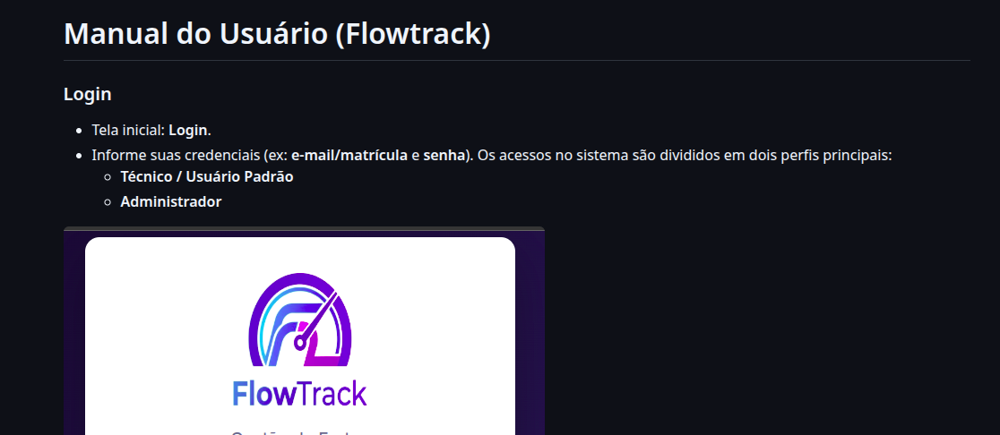

<h2>Sobre mim</h2>

Comecei minha trajetória na área de tecnologia cursando Análise e Desenvolvimento de Sistemas na ETEP de São José dos Campos. Durante esse período, atuei como suporte N2, trabalhando com aplicações, consultas em banco de dados e análise de problemas. Foi nessa experiência que descobri meu interesse pela área de banco de dados.

Buscando me especializar, iniciei uma pós-graduação em Administração de Banco de Dados e, durante minha atuação profissional, passei a assumir responsabilidades relacionadas à administração e manutenção das bases de dados da empresa. Essa experiência reforçou minha decisão de seguir carreira na área de dados.

Posteriormente, iniciei o curso de Banco de Dados na FATEC Prof. Jessen Vidal, buscando complementar minha formação e aprofundar meus conhecimentos. Ao longo dessa trajetória, também desenvolvi experiência com tecnologias como SQL, PostgreSQL, SQL Server e SAP HANA, além de linguagens como Java e JavaScript.

Atualmente, busco consolidar minha carreira na área de banco de dados, unindo minha experiência profissional com a formação acadêmica e ampliando meus conhecimentos em administração, desenvolvimento e otimização de bases de dados.

## Contatos
* [Git](https://github.com/fagnerlouis)
* [LinkedIn](https://www.linkedin.com/in/fagnerlouis/)

## Meus Principais Conhecimentos

**Aplicações e dados**

## Meus Projetos

### Em 2026-1

### Empresa Parceira: [IPEM - Instituto de Pesos e Medidas](https://github.com/LizardsDBA/API-2026-3)

### Problema:
O desafio consiste no desenvolvimento de um sistema web para controle e análise dos abastecimentos das viaturas do IPEM – Regional de São José dos Campos, substituindo o atual processo manual realizado por meio de pranchetas físicas mantidas nos veículos. Atualmente, os técnicos registram informações como quilometragem, litros abastecidos, valor pago e número da nota fiscal de forma manual, o que dificulta a consolidação mensal dos dados, a análise comparativa entre viaturas e o acompanhamento do consumo médio de combustível. A proposta do projeto é digitalizar esses registros, garantindo maior organização, rastreabilidade e confiabilidade das informações, além de permitir a geração de indicadores gerenciais que apoiem a tomada de decisão e facilitem a consolidação dos dados para posterior inserção no SGI.

### Solução Entregue pela Equipe:
FlowTrack — Plataforma de Controle de Abastecimento e Utilização de Viaturas. O FlowTrack permitirá o registro digital da utilização de viaturas, substituindo o controle manual realizado em pranchetas. A solução possibilita registrar abastecimentos, início e término de uso dos veículos, mantendo histórico completo de quilometragem, consumo e despesas. Além disso, contará com gerenciamento de cadastros, avisos de manutenção preventiva baseados em quilometragem e visualização de indicadores e relatórios consolidados, facilitando o acompanhamento da frota e a organização das informações para posterior inserção no SGI.

[Repositório do Projeto ](https://github.com/LizardsDBA/API-2026-3)

#### Tecnologias Utilizadas
> - **Java**: Utilizado no desenvolvimento do backend, proporcionando flexibilidade e facilidade de manutenção na lógica do sistema.
> - **JavaScript**: Ferramenta utilizada para o desenvolvimento da interface gráfica do usuário, permitindo uma criação rápida e simples da UI.
> - **HTML**: Utilizado para design e prototipagem da interface, ajudando no planejamento do layout da aplicação.
> - **Git e GitHub**: Essenciais para controle de versão e colaboração entre os membros da equipe, garantindo o gerenciamento eficiente do código.
> - **Jira**: Ferramenta usada para gerenciar as tarefas do projeto e organizar o fluxo de trabalho da equipe.

#### Contribuições Pessoais

  
<strong>Infraestrutura e Deploy</strong>

   

  - **Configuração de ambiente AWS**: configuração do `application.properties` para conexão com o banco de dados via AWS RDS.
  - **Containerização**: configuração de Docker e variáveis de ambiente para o deploy na AWS.
  - **Inicialização do banco**: configuração de criação automática do banco de dados (`create database if not exists`) para simplificar o setup em novos ambientes.
  - **Ajustes de setup inicial**: correções de configuração de senha, importação de seeds e ajustes de CSS realizados na primeira sprint do projeto.

  
<strong>Geolocalização e Integração com API de Endereços</strong>

   

  - **Migração da lógica para o backend**: centralização das chamadas à API de geolocalização, que antes eram feitas pelo frontend, passando a serem requisitadas pelo back-end.
  - **Fallback por texto**: implementação de busca de latitude/longitude por texto quando o CEP não é informado pelo usuário.
  - **Otimização de performance**: cache de pontos já pesquisados, reduzindo chamadas repetidas à API e acelerando o carregamento do mapa.
  - **Refatoração da renderização**: separação da lógica de renderização do mapa da lógica de busca de dados.

  
<strong>Modelagem do Banco de Dados</strong>

   

  - **Modelagem completa (MER)**: responsável pela modelagem de todo o banco de dados do projeto, definindo entidades, relacionamentos e regras de integridade.
  - **Dicionário de Dados**: elaboração do dicionário de dados completo, documentando todas as tabelas, colunas, tipos e restrições do sistema.

   

  **📎 Documento produzido:**

  - 📊 [Dicionário de Dados](https://github.com/LizardsDBA/API-2026-3/blob/main/docs/manuais/tecnico/Dicionario%20de%20dados.md)
     
    

  
<strong>Product Owner</strong>

   

  - **Levantamento de requisitos**: comunicação constante com o cliente (IPEM) via Slack, tirando dúvidas sobre as funcionalidades e coletando as informações necessárias para a construção das User Stories.
  - **Validação de wireframes**: envio dos wireframes para aprovação do cliente, garantindo alinhamento entre o que estava sendo desenvolvido e a expectativa do usuário final.
  - **Construção das User Stories**: elaboração de todas as histórias de usuário do projeto, servindo de base para o planejamento das sprints.
  - **Priorização de entregas**: gerenciamento contínuo das prioridades do backlog ao longo do desenvolvimento.
  - **Documentação do projeto**: estruturação e escrita de toda a documentação (requisitos, escopo e entregas).

   

  **📎 Documentos produzidos:**

  - 📘 [Manual Técnico](https://github.com/LizardsDBA/API-2026-3/blob/main/docs/manuais/tecnico/Manual%20Tecnico.md)
     
    

  - 📗 [Manual do Usuário](https://github.com/LizardsDBA/API-2026-3/blob/main/docs/manuais/usuario/Manual%20Usuario.md)
     
    

#### Hard Skills

- **SQL** : Sei fazer com autonomia
- **Jira** : Sei fazer com autonomia
- **Modelagem** : Sei fazer com autonomia

#### Soft Skills

**Comunicação**: Exercitei minhas habilidades de comunicação ao interagir frequentemente com a equipe, transmitindo a visão do cliente e alinhando expectativas. Mantive um diálogo aberto e constante com o cliente para entender suas necessidades e garantir que as funcionalidades desenvolvidas atendessem às suas expectativas.

**Autodidatismo** : Demonstrei proatividade ao buscar e adquirir conhecimentos sobre tecnologias novas, como Spring Boot, que não tinha familiaridade anteriormente. 

**Trabalho sob pressão**: Em momentos de baixa de recursos no time, assumi mais responsabilidades do que o habitual para garantir que o projeto fosse entregue dentro do prazo estabelecido. 
