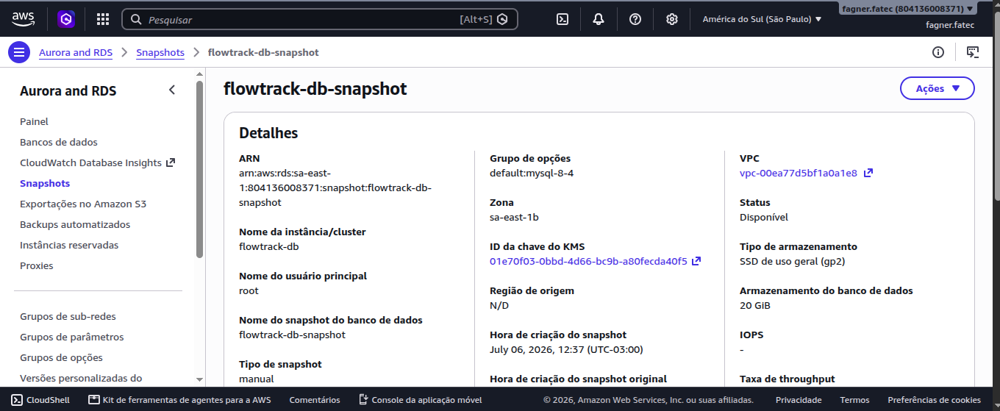
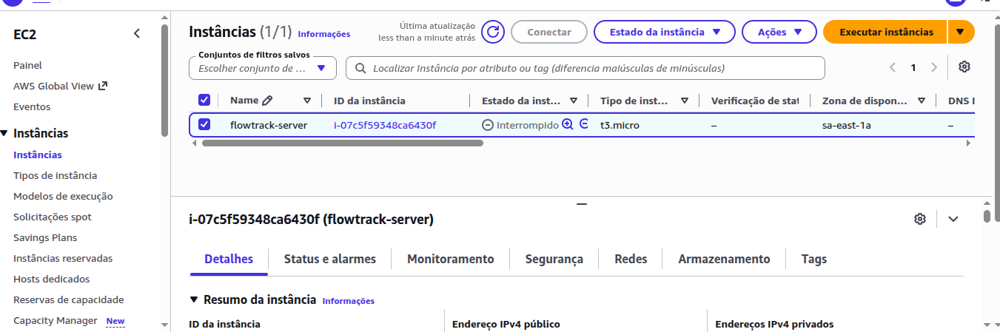
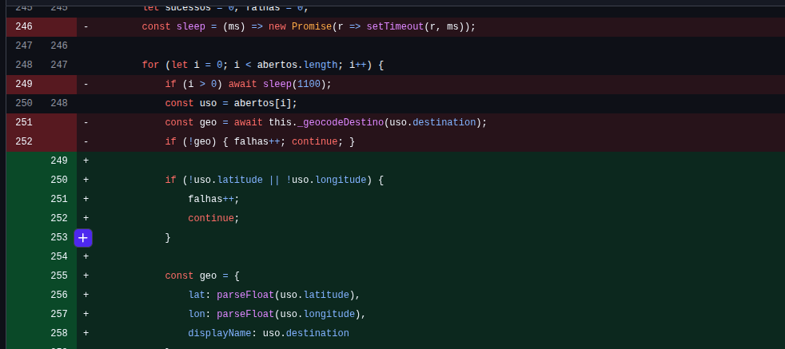
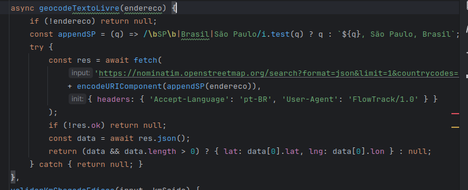
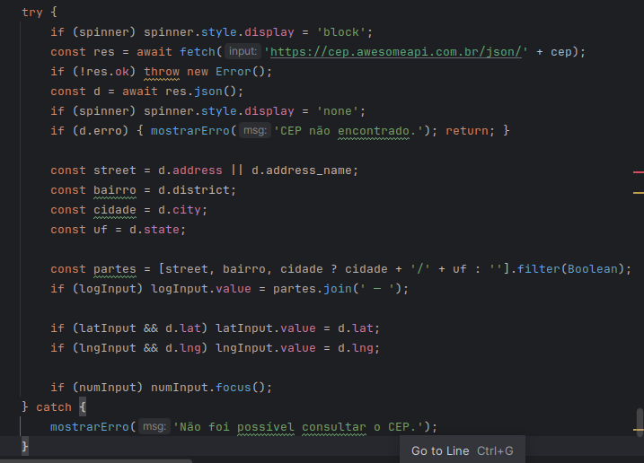
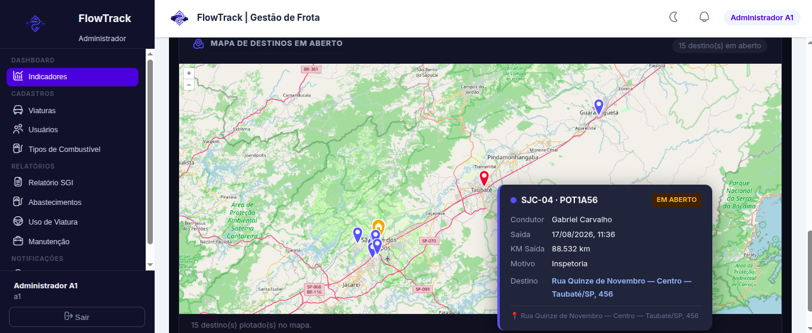
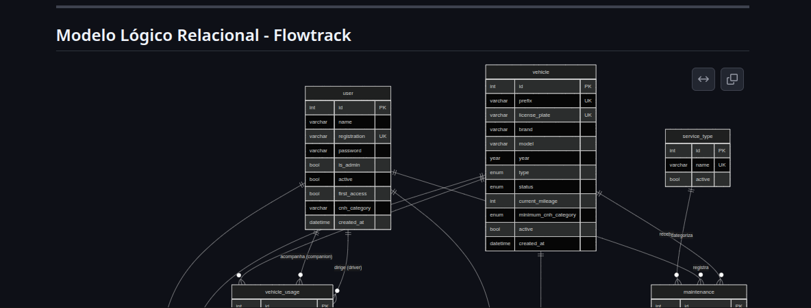
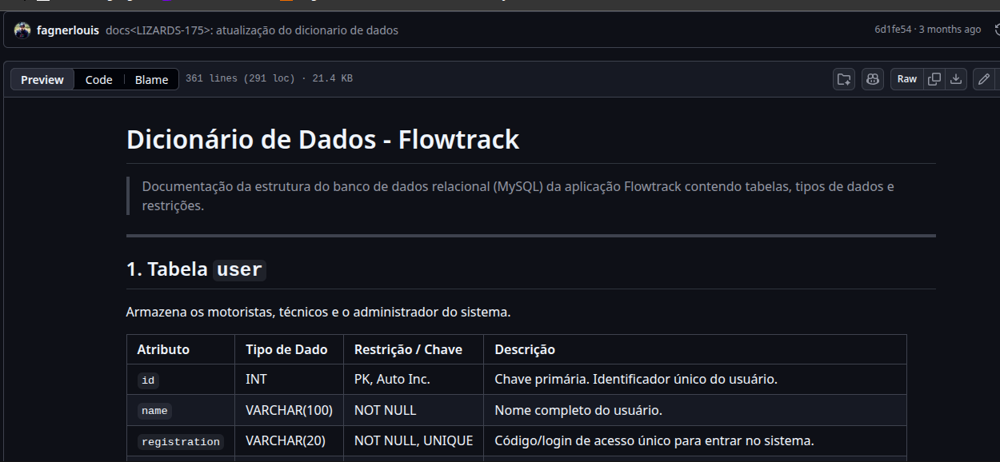
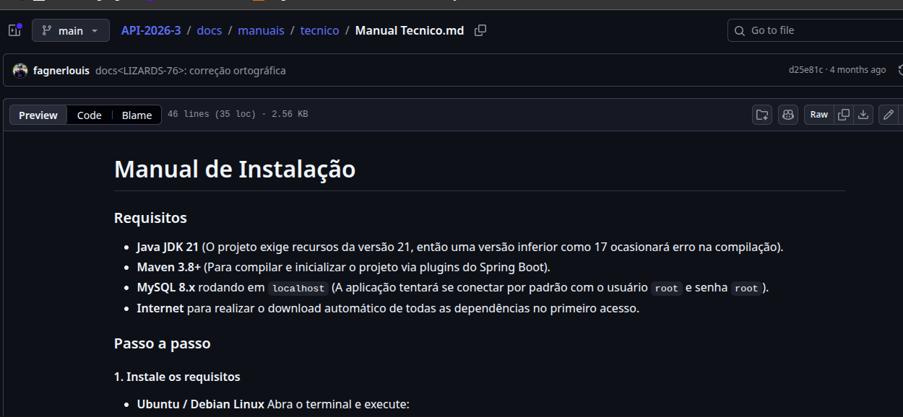
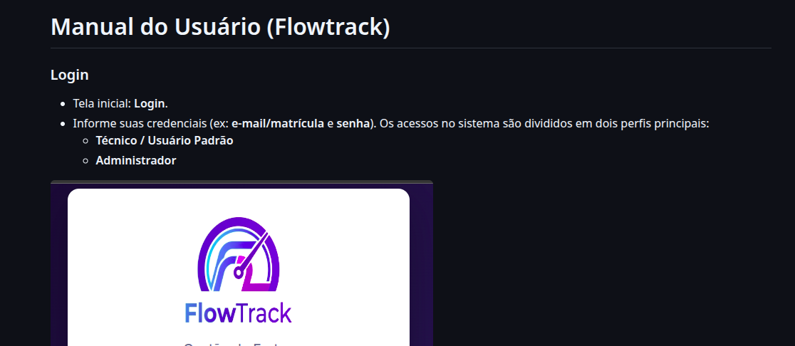

  

  <h1>Fagner Louis</h1>
  
  <h3 style="color: #666;">Administrador de Banco de Dados | Consultor SAP B1</h3>
  
   

  

    
    
  

## Sobre Mim

Comecei minha trajetória na área de tecnologia atuando como suporte N2 e logo descobri meu grande interesse pela área de dados. Minha missão é consolidar minha carreira em banco de dados, atuando na administração, desenvolvimento e otimização de bases de dados.

- **Atuação:** Possuo experiência assumindo responsabilidades relacionadas à administração e manutenção de bases de dados corporativas, além de suporte N2 trabalhando com aplicações e resolução de problemas.
- **Formação:** Pós-graduado em **Administração de Banco de Dados**, cursando **Banco de Dados** na FATEC Prof. Jessen Vidal e formado em **Análise e Desenvolvimento de Sistemas** pela ETEP.
- **Objetivos:** Focado em consolidar minha carreira na área de banco de dados, unindo experiência profissional e acadêmica.
- **Background:** Iniciei com suporte técnico e consultas estruturadas em banco de dados, desenvolvendo forte conhecimento em bancos como PostgreSQL, SQL Server e SAP HANA, além de linguagens como Java e JavaScript.

 
 

**Aplicações e dados**

 

## Meus Projetos

### Em 2026-1

### Empresa Parceira: [IPEM - Instituto de Pesos e Medidas](https://github.com/LizardsDBA/API-2026-3)

### Problema:
O desafio consiste no desenvolvimento de um sistema web para controle e análise dos abastecimentos das viaturas do IPEM – Regional de São José dos Campos, substituindo o atual processo manual realizado por meio de pranchetas físicas mantidas nos veículos. Atualmente, os técnicos registram informações como quilometragem, litros abastecidos, valor pago e número da nota fiscal de forma manual, o que dificulta a consolidação mensal dos dados, a análise comparativa entre viaturas e o acompanhamento do consumo médio de combustível. A proposta do projeto é digitalizar esses registros, garantindo maior organização, rastreabilidade e confiabilidade das informações, além de permitir a geração de indicadores gerenciais que apoiem a tomada de decisão e facilitem a consolidação dos dados para posterior inserção no SGI.

### Solução Entregue pela Equipe:
FlowTrack — Plataforma de Controle de Abastecimento e Utilização de Viaturas. O FlowTrack permitirá o registro digital da utilização de viaturas, substituindo o controle manual realizado em pranchetas. A solução possibilita registrar abastecimentos, início e término de uso dos veículos, mantendo histórico completo de quilometragem, consumo e despesas. Além disso, contará com gerenciamento de cadastros, avisos de manutenção preventiva baseados em quilometragem e visualização de indicadores e relatórios consolidados, facilitando o acompanhamento da frota e a organização das informações para posterior inserção no SGI.

[Repositório do Projeto](https://github.com/LizardsDBA/API-2026-3)

#### Tecnologias Utilizadas
> - **Java**: Utilizado no desenvolvimento do backend, proporcionando flexibilidade e facilidade de manutenção na lógica do sistema.
> - **JavaScript**: Ferramenta utilizada para o desenvolvimento da interface gráfica do usuário, permitindo uma criação rápida e simples da UI.
> - **HTML**: Utilizado para design e prototipagem da interface, ajudando no planejamento do layout da aplicação.
> - **Git e GitHub**: Essenciais para controle de versão e colaboração entre os membros da equipe, garantindo o gerenciamento eficiente do código.
> - **Jira**: Ferramenta usada para gerenciar as tarefas do projeto e organizar o fluxo de trabalho da equipe.

####  Contribuições Pessoais

  
<strong>Infraestrutura e Deploy</strong>

   

  - **Configuração de ambiente AWS**: configuração do `application.properties` para conexão com o banco de dados via AWS RDS.
  - **Containerização**: configuração de Docker e variáveis de ambiente para o deploy na AWS.
  - **Inicialização do banco**: configuração de criação automática do banco de dados (`create database if not exists`) para simplificar o setup em novos ambientes.
  - **Ajustes de setup inicial**: correções de configuração de senha, importação de seeds e ajustes de CSS realizados na primeira sprint do projeto.

   

  **📎 Evidências da infraestrutura:**

  - 🗄️ Instância RDS
     
    

  - 💻 Instância EC2
     
    

  
<strong>Geolocalização e Integração com API de Endereços</strong>

   

  - **Migração da lógica para o backend**: centralização das chamadas à API de geolocalização, que antes eram feitas pelo frontend, passando a serem requisitadas pelo back-end. Eliminação do loop de geocodificação síncrona no carregamento da tela (que aplicava um delay de 1.1s por destino para respeitar o rate limit da API), passando a calcular a latitude/longitude uma única vez no momento do registro de saída da viatura — sem mais onerar o carregamento do dashboard.

     
    

  - **Fallback por texto**: implementação de busca de latitude/longitude por texto quando o CEP não é informado pelo usuário.

     
    

  - **Consulta de CEP**: integração com API de consulta de CEP para preenchimento automático de endereço, bairro, cidade e UF, com tratamento de erro caso o CEP não seja encontrado.

     
    

  - **Otimização de performance**: cache de pontos já pesquisados, reduzindo chamadas repetidas à API e acelerando o carregamento do mapa.
  - **Refatoração da renderização**: separação da lógica de renderização do mapa da lógica de busca de dados.

     
    

  
<strong>Modelagem do Banco de Dados</strong>

   

  - **Modelagem completa (MER)**: responsável pela modelagem de todo o banco de dados do projeto, definindo entidades, relacionamentos e regras de integridade. Diagrama construído em Mermaid e evoluído ao longo do projeto conforme o schema foi sendo ajustado às novas funcionalidades.

     
    

  - **Dicionário de Dados**: elaboração do dicionário de dados completo, documentando todas as tabelas, colunas, tipos e restrições do sistema.

   

  **📎 Documento produzido:**

  - 📊 [Dicionário de Dados](https://github.com/LizardsDBA/API-2026-3/blob/main/docs/manuais/tecnico/Dicionario%20de%20dados.md)
     
    

  
<strong>Product Owner</strong>

   

  - **Levantamento de requisitos**: comunicação constante com o cliente (IPEM) via Slack, tirando dúvidas sobre as funcionalidades e coletando as informações necessárias para a construção das User Stories.
  - **Validação de wireframes**: envio dos wireframes para aprovação do cliente, garantindo alinhamento entre o que estava sendo desenvolvido e a expectativa do usuário final.
  - **Construção das User Stories**: elaboração de todas as histórias de usuário do projeto, servindo de base para o planejamento das sprints.
  - **Priorização de entregas**: gerenciamento contínuo das prioridades do backlog ao longo do desenvolvimento.
  - **Documentação do projeto**: estruturação e escrita de toda a documentação (requisitos, escopo e entregas).

   

  **📎 Documentos produzidos:**

  - 📘 [Manual Técnico](https://github.com/LizardsDBA/API-2026-3/blob/main/docs/manuais/tecnico/Manual%20Tecnico.md)
     
    

  - 📗 [Manual do Usuário](https://github.com/LizardsDBA/API-2026-3/blob/main/docs/manuais/usuario/Manual%20Usuario.md)
     
    

#### Hard Skills

##### O que desenvolvi (com autonomia)

**Modelagem de Dados**: Fui responsável pela modelagem completa do banco de dados do projeto, definindo entidades, relacionamentos e regras de integridade. Construí o MER em Mermaid e o evoluí ao longo das sprints conforme novas funcionalidades exigiam ajustes no schema, além de elaborar o dicionário de dados documentando todas as tabelas, colunas, tipos e restrições.

**SQL / MySQL**: Utilizei SQL no dia a dia do projeto para consultar, filtrar, relacionar e agregar dados (JOINs, funções de agregação, ordenação), principalmente para validar as informações registradas pelo sistema e investigar inconsistências durante os testes das funcionalidades.

**Git / GitHub**: Trabalhei com branches, merges e resolução de conflitos em um repositório compartilhado por toda a equipe, além de organizar e manter a documentação do projeto (manuais técnico e do usuário, dicionário de dados) diretamente no GitHub.

**AWS e Cloud Computing**: Configurei a infraestrutura de deploy do projeto, com a aplicação rodando em uma instância EC2 e o banco de dados no RDS. Ajustei o `application.properties` para a conexão com o RDS e configurei a criação automática do banco (`create database if not exists`) para simplificar o setup em novos ambientes.

**Linux**: Utilizo Linux como ambiente principal de desenvolvimento, o que me deu autonomia para navegar, configurar e operar o servidor da aplicação pelo terminal durante o deploy e a manutenção do ambiente.

##### O que desenvolvi (conhecimento intermediário)

**Java / Spring Boot**: Atuei no backend migrando as chamadas à API de geolocalização, que antes eram feitas no frontend, para o servidor. Com isso, a latitude/longitude passou a ser calculada uma única vez no registro de saída da viatura, eliminando o loop síncrono (com delay de 1,1s por destino) que deixava o dashboard lento.

**APIs REST**: Integrei o sistema com uma API de consulta de CEP para preenchimento automático de endereço, com tratamento de erro para CEPs não encontrados, e implementei o fallback de geolocalização por texto quando o CEP não é informado. Também apliquei cache dos pontos já pesquisados para reduzir chamadas repetidas à API.

**Docker**: Configurei a containerização da aplicação e as variáveis de ambiente necessárias para o deploy na AWS, utilizando logs dos containers para identificar e corrigir problemas de configuração.

##### O que gostaria de desenvolver

**Spring Security**: Quero aprofundar autenticação e autorização (roles e JWT), pois a proteção de endpoints e o controle de acesso por perfil de usuário são essenciais em sistemas que lidam com dados de clientes reais, como o do IPEM.

**Microsserviços**: Tenho interesse em entender como dividir uma aplicação em serviços independentes que se comunicam por APIs, já que no projeto a integração com serviços externos (CEP e geolocalização) mostrou a importância de separar responsabilidades e isolar dependências.

#### Soft Skills

##### O que desenvolvi

**Comunicação**: Como Product Owner, mantive contato constante com o cliente (IPEM) via Slack para tirar dúvidas, coletar requisitos e validar os wireframes antes do desenvolvimento. Ao mesmo tempo, transmiti essa visão para a equipe, alinhando expectativas entre o que o cliente precisava e o que estava sendo construído.

**Organização**: Fui responsável por estruturar e escrever toda a documentação do projeto (requisitos, escopo, manuais e dicionário de dados), além de organizar o backlog e as atividades no Jira, o que deu à equipe uma base clara para o planejamento de cada sprint.

**Proatividade**: Mesmo atuando como Product Owner, fui além do papel e contribuí tecnicamente no desenvolvimento, assumindo a infraestrutura de deploy, a modelagem do banco e a refatoração da geolocalização. Também propus melhorias, como mover o cálculo de coordenadas para o backend, que resolveu um problema de performance do dashboard.

**Resolução de Problemas**: Ao identificar a lentidão no carregamento do mapa, investiguei a causa (chamadas síncronas à API com delay por destino) em vez de apenas contornar o sintoma, e implementei uma solução estrutural com cálculo único no registro e cache dos pontos pesquisados.

**Trabalho em Equipe**: Atuei como ponte entre cliente e desenvolvedores, participando das decisões técnicas do projeto e compartilhando soluções com o time, o que contribuiu para que as entregas de cada sprint estivessem alinhadas com a expectativa do cliente.

##### O que gostaria de desenvolver

**Comunicação em Público**: Nas apresentações das sprints percebi que preciso ganhar mais confiança ao apresentar, especialmente ao explicar conteúdo técnico de forma simples e objetiva para clientes e avaliadores.

**Liderança e Gestão de Equipes**: Como PO, acompanhei de perto o trabalho do time e senti a necessidade de melhorar a distribuição de atividades, o acompanhamento das tarefas e a forma de dar feedback para apoiar colegas com dificuldades.

**Gestão de Projetos**: A priorização do backlog me mostrou a importância de planejar bem e antecipar riscos. Quero aprofundar metodologias ágeis e técnicas de gestão de riscos e prioridades.

**Tomada de Decisão**: Decidir prioridades de entrega com prazos curtos exigiu analisar cenários rapidamente. Quero desenvolver uma tomada de decisão mais embasada em dados e na análise de impacto.

**Inglês Profissional**: Grande parte da documentação técnica que consultei durante o projeto está em inglês, e quero aprimorar vocabulário técnico e conversação para atuar com mais segurança em reuniões e ambientes profissionais.

 
 

## Experiência Profissional

**SPS Group | Junior SAP Business One Consultant** *(Dezembro/2025 – Atualmente)*
> Desenvolvimento e customização de ERP na plataforma Aster, integrado ao SAP Business One.
- Desenvolvimento de queries complexas em SQL Server (T-SQL) e SAP HANA, e uso de JavaScript em estruturas JSON para customizar interface e automatizar regras de negócio.
- Customização de telas: criação e modificação de campos, botões, validações e fluxos operacionais nas telas do SAP Business One via plataforma Aster.
- Desenvolvimento de relatórios personalizados, dashboards interativos e layouts de impressão com Crystal Reports (.RPT).
- Criação de UserPages para suportar processos de negócio específicos de clientes, estendendo as funcionalidades do sistema.
- Implementação de lógica de negócio via JavaScript event handlers e integrações através das APIs do SAP Service Layer.

**SPS Group | Trainee SAP Business One Consultant** *(Abril/2025 – Dezembro/2025)*
> Desenvolvimento e customização de ERP na plataforma Aster, integrado ao SAP Business One.
- Desenvolvimento de queries complexas em SQL Server (T-SQL) e SAP HANA, e uso de JavaScript em estruturas JSON para customizar interface e automatizar regras de negócio.
- Customização de telas: criação e modificação de campos, botões, validações e fluxos operacionais nas telas do SAP Business One via plataforma Aster.
- Desenvolvimento de relatórios personalizados, dashboards interativos e layouts de impressão com Crystal Reports (.RPT).
- Criação de UserPages para suportar processos de negócio específicos de clientes, estendendo as funcionalidades do sistema.
- Implementação de lógica de negócio via JavaScript event handlers e integrações através das APIs do SAP Service Layer.

**Log Smart Brasil | Senior Support Analyst (N3)** *(Março/2023 – Fevereiro/2025)*
> Suporte N3 em sistemas WMS e infraestrutura, atuando em chamados de média/alta complexidade.
- Testes de API utilizando Postman em ambientes locais e de produção.
- Desenvolvimento de queries avançadas em PostgreSQL, incluindo consultas customizadas para relatórios e análise de dados do sistema.
- Testes manuais de novas funcionalidades e correções de bugs para garantir estabilidade e precisão funcional do sistema.
- Manutenção e monitoramento de servidores, garantindo disponibilidade, performance e confiabilidade de aplicações em ambientes Linux.

**MB de Moura Baterias Epp | E-commerce Operations Analyst** *(Janeiro/2018 – Fevereiro/2023)*
> Atendimento ao cliente, gestão de e-commerce e suporte online, cobrindo atividades de pré-venda e pós-venda.
- Liderou a implementação da loja online da empresa no Mercado Livre, tornando-se um dos maiores vendedores de baterias de moto na plataforma.
- Otimizou processos logísticos e de envio, transformando a loja física em ponto de coleta do Mercado Livre, viabilizando operações de despacho internas.
- A iniciativa aumentou a receita mensal em mais de 40%, atraiu tráfego adicional para a loja física, reduziu a dependência de campanhas pagas no Google Ads e gerou receita adicional via operação de ponto de coleta.

 
 

## Cursos e Formação

  
<b>Ver Histórico</b>

   
  <ul>
    <li><b>FATEC Prof. Jessen Vidal:</b> Superior em Banco de Dados (Cursando).</li>
    <li><b>Pós-Graduação:</b> Administração de Banco de Dados.</li>
    <li><b>ETEP São José dos Campos:</b> Análise e Desenvolvimento de Sistemas.</li>
  </ul>

 

  <b>Obrigado por visitar meu portfólio! Sinta-se à vontade para conectar. 👨💻</b>

